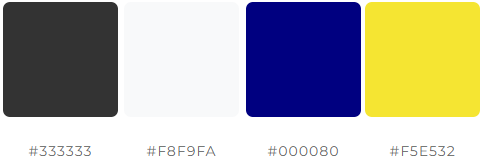
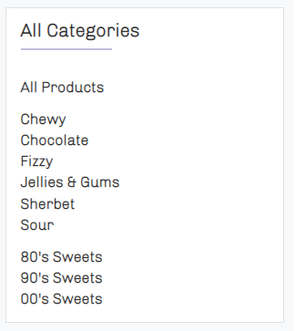

# Classic Confectionery

A business to customer e-commerce application for an online sweet retailer. Built using the Django framework. Allowing for user account creation and authorization capabilities, in order to implement favorite's and reviews features, along with fast and secure checkout functionality. Payment processing is handled securely by Stipe. Anonymous users are still able to sort & filter products, view product reviews and complete purchases however. An inquiry feature is also offered to all site users.
___
## Table of Contents 

* [User Experience (UX)](#userexperience)
    * [Site Goal](#sitegoal)
    * [Target Audience](#targetaudience)
    * [Owner Goals](#ownergoals)
    * [How These Goals are Addressed](#goaladdress)
    * [Data Required](#datarequired)
    * [Security Features](#securityfeatures)
* [Design](#design)
    * [Color Scheme](#colorscheme)
    * [Typography](#typography)
    * [Imagery](#imagery)
    * [Layout](#layout)
* [Web Marketing](#marketing)
* [SEO](#seo)
* [Development](#development)
* [Database Schema](#database)
* [Existing Features](#existingfeatures)
    * [Product Search](#productsearch)
    * [Checkout](#checkout)
    * [User Profiles](#profiles)
    * [Favorites](#favs)
    * [Reviews](#review)
    * [Inquiry](#inquire)
    * [Product Management](#prodmanage)
* [Features Left to Implement](#toimplement)
* [Testing](#testing)
    * [Bugs Found in Development](#developmentbugs)
    * [Validator Testing](#validators)
    * [Lighthouse](#lighthouse)
    * [Automated Testing](#automated)
    * [Running the Automated Tests](#runningauto)
    * [Manual](#manual)
* [Unfixed Bugs](#bugs)
* [Deployment](#deployment)
* [Create a Clone](#clone)
* [Run Locally](#locally)
* [Technologies Used](#tech)
    * [Languages Used](#lang)
    * [Frameworks & Toolkits](#frametool)
    * [Database Management Systems](#dbsm)
    * [Cloud Services](#cloud)
    * [Marketing Services](#marketservice)
    * [Email Backend](#email)
    * [Server](#server)
    * [Version Control](#version)
    * [Libraries, Packages & Applications](#lib)
    * [Programs](#program)
    * [Payment Processor](#payment)
* [Credits](#credits)
    * [Content](#concred)
    * [Media](#media)
___
### User Experience (UX) 

*For this project i initially developed a selection of user personas which my user stories have all been developed from, creating my epics. Below these user personas can be seen.*

* **Peyton Post**

    * Who are they?
        * | *Gender*: Female | *Age*: 21 | *Nationality*: British | *Location*: Stevenage | *Occupation*: Student |
        ---
    * What is their main goal?
        * To order sweets as a birthday present for their 30-year-old brother that he would have eaten as a pre-teen/young child.
        ---
    * What is their barrier to achieving this goal?
        * Unsure of what sweets where popular in the 90’s/’00s.
        ---

* **Rorie Wyatt**

    * Who are they?
        * | *Gender*: Female | *Age*: 38 | *Nationality*: British | *Location*: Edinburgh | *Occupation*: Nurse |
        ---
    * What is their main goal?
        * To buy some sweets their two young children can try (12 & 10), that they ate as a kid.
        ---
    * What is their barrier to achieving this goal?
        * The ability to order a varied selection of sweets in a reasonable quantity. 
        ---

* **Blair Horn**

    * Who are they?
        * | *Gender*: Male | *Age*: 26 | *Nationality*: British | *Location*: Berkshire | *Occupation*: Accountant |
        ---
    * What is their main goal?
        * To buy a large selection of their favorite sweets to take into work and share with their colleagues.
        ---
    * What is their barrier to achieving this goal?
        * The ability to order a large and varied selection of sweets that come in a container suitable for being taken on a work commute. 
        ---

* **Rhys Powell**

    * Who are they?
        * | *Gender*: Male | *Age*: 40 | *Nationality*: British | *Location*: Swansea | *Occupation*: Brick Layer |
        ---
    * What is their main goal?
        * To regularly buy a selection of sweets to keep in the treat draw at home.
        ---
    * What is their barrier to achieving this goal?
        * The ability to browse an online sweet store and create themselves a pick’n’mix style bundle. 
        ---

* **Augustine Evanson**

    * Who are they?
        * | *Gender*: Male | *Age*: 33 | *Nationality*: British | *Location*: Warrington | *Occupation*: Sweet Seller |
        ---
    * What is their main goal?
        * To expand their e-commerce business selling sweets online.
        ---
    * What is their barrier to achieving this goal?
        * They currently don’t have a website.
___

**Site Goal** 

* The goal of the site is to meet the goals of the above user personas in a robust, secure and responsive web application.

**Target Audience** 

* The intended target audience of the application is the generation of people referred to as 'Millennials', people born between 1981-1996 and in turn their children, however the primary focus is on millennials.

**Owner Goals** 

* The site owners goal first and foremost is to become the owner of e-commerce store which meets their clients needs. In order to achieve this goal efforts to market their store and consistently build a client base must also be made with the long term goal of being able to offer services on online take away platforms like Uber Eats & Just Eat.

**How These Goals are Addressed** 

* Peyton Post

    In order to meet the goals of Peyton, There is a strong focus on users being able to see sweets popular during the: 1980's, 1990's and 2000's. Key time periods which capture all the points at which millennials would have been kids and pre-teens with sweets being a key feature in their life. Due to them also being a student the ability to sort sweets by price is provided as it is reasonably safe to assume they have a limited budget. From here Peyton is able to add products like 'Fizzy Twin Cherries' or 'Raspberry Bon Bons' to their cart, which details the order subtotals clearly, before navigating to the order form and checking out using Stripes secure payment service. Successfully purchasing sweets as a birthday present for their older brother that they would have eaten as a child.

* Rorie Wyatt

    In order to meet the goals of Rorie, similar focus on filtering sweets by time periods covering millennial youth has been paid. However, Rorie intends on purchasing sweets to give her young children. Because of this each product has clear ingredient and allergen information displayed in its description. They also wish to order a variety of items in reasonable quantities, this is achieved by extensive site navigation options, allowing Rorie to explore the stores products and add them to her cart with ease. All whilst there weight and quantity fields are displayed clearly. Again, once Rorie has added her selection of sweets to her cart she can clearly see the subtotals, but also update items from within the cart itself. Allowing her to view her order as a whole and make the decision if her order is of a good variety of sweets at reasonable quantity. From here she can again complete her purchase using Stripes secure payment services, Successfully purchasing sweets she ate as a child in order to give to her kids.

* Blair Horn

    Blair has similar goals to Rorie, however they intend on making a considerably larger order. Naturally this raises concerns surrounding delivery. In order to meet the goals of Blair FAQ and Delivery Information pages have been setup, which cover order packaging. From here Blair can be satisfied in the knowledge that when their order makes it safely to them, they can then safely commute with it to work. A weight limit of 5kg per product also more than covers them wanting to purchase a large selection of sweets.

* Rhys Powell

    Whilst Rhys has similar goals to Rorie and Blair, in terms of wanting to purchase a large selection of sweets, they intend on making smaller more regular purchases. To help them achieve this goal user account creation capabilities are available. Once Rhys has created and verified their account, they can then begin adding products to their favorites list, from within this favorites list they can then add products directly to their cart without navigating across the site to find them. This also allows for them to create pick & mix styles orders. Once Rhys has made his initial purchase, provided he checked the save info box on the checkout form, he then doesn't need to enter his contact and delivery details again. Only his payment details, this is unavoidable as Classic Confectionery doesn't store or process payment information. However, user profile and favorite features successfully allow Rhys to achieve his goal of regularly purchasing sweets to keep in his treat draw at home.

* Augustine Evanson

    With Augustine being the site owner their main goal of becoming the owner of an e-commerce sweet store which meets their clients needs is met upon deployment of the Classic Confectionery website, as the website in its current state is able to allow the four user personas above to meet their goals. The secondary goal of Augustine, which is to market their store and build a consistent client base is harder to quantify at this point. However, web marketing in terms of organic social media marketing and newsletter services have been implemented along side search engine optimization, all which should help Augustine achieve his goals. 

**Data Required** 

* Due to the nature of the application a large amount of sensitive user data is required. Efforts to mitigate the extent of this have been made in the form of using a secure payment provider which allows for anonymous users to complete purchases. Being an online e-commerce store though means contact and delivery information is required for orders to be shipped, storing this information in an authorized users profile is optional and raw passwords are never stored within the application, further allowing users to limit the amount of their data the application stores. Inline with EU GDPR laws the websites privacy policy information can be found with the site footer.

**Security Features** 

* User Authentication

    Django's allauth package is used to implement user authentication. This coupled with Django's login_required decorator ensures that a users personal information regarding order history and their user profile can only be accessed by the owner of it. Similar measures have been taken on the favorites app, as well as the CRUD functionality of a users reviews. When adding, editing or deleting products on the store extra conditions have been implemented in the view to ensure only users with super status can perform these actions.

* Secure Payment Method

    Stipe is used as a secure payment provider for the store, this robust and trusted services means no payment information is stored within the application, protecting both site users and site owner.

* env.py

    An env.py file is utilized in conjunction with a .gitignore file to prevent API keys being visible in version control.

[Return to Table of Contents](#contents)
___

### Design 

- **Color Scheme** 

    * When developing the color scheme for this project i began by scrolling through images of sweets that span the time period of 1980-2010, as this period captured when millennials would have been children/teenagers, from here i got a vague idea of what colors would be reflective of a typical millennial childhood. I then reinforced my ideas with this [blog post](https://juiceboxinteractive.com/blog/color/). Finally deciding on a scheme that incorporated blue, yellow and pink. From here i began testing different variations of these colors together in the [web aim contrast checker](https://webaim.org/resources/contrastchecker/) to ensure my scheme met [WCAG](https://www.w3.org/WAI/standards-guidelines/wcag/) AAA accessibility guidelines. Not wanting to create a garish display, My final scheme consists of predominantly a charcoal color, set against white (FFFFFF) or cream (The bootstrap color of F8F9FA), with yellow and blue used against it. The color pallet can be seen below.

        

- **Typography** 

    * For this project i wanted a font that echoed the fonts used across popular sweets in the UK from the 90's & '00s. Using this [article](https://metro.co.uk/2015/03/06/23-sweets-that-got-all-our-mouths-watering-in-the-90s-5091799/) and this [blog post](https://www.typewolf.com/google-fonts) I decided that the [Chivo](https://fonts.google.com/specimen/Chivo?query=chiv) font was a good fit. The main body content is styled in the light 300 weight and the headers styled with the italic 900 weight. This mixture brings both the big bold text with crisp edges as well as the light and rounded text, popular on sweet packaging familiar to millennials, to the project. 

- **Imagery** 

    * As the main site components use a refined color pallet, i chose to use bright and colorful imagery in key areas across the site, attempting to capture the massive spectrum of colors used in the variety of sweets available. I particularly focused on imagery of pick & mix stands to appeal to a users inner child and bring back those memories of being a kid in a candy store. In terms of highlighting the products themselves, a clear single image set on a plain background has been used for each, as i felt the products essentially spoke for themselves.

    * Within the checkout/profiles functionality a users current order and order history have been developed to appear like a receipt and packaging label respectfully. This is done deliberately as i felt this way of presenting the information would be familiar to users and easy to understand. A similar approach has been taken with the 'Favorites' functionality on items, with an heart icon being used that displays dynamically dependant on status and is reflective of the twitters favorites functionality, with the intention that it's use would be intuitive for users. 

- **Layout** 

    * The app is built using a fully responsive multi-page layout, with a dynamic navigation bar and footer used across all pages, inviting the user to explore the stores selection of sweets at every possible opportunity. Within the footer key business details are presented as well as links to external sources related to the company and health related charities relevant to high sugar intake. 
    
    * Bootstrap toasts have also been utilized to highlight user actions and provide feedback on key functions. Aside from the core web app, email backend also provides user feedback on account authorization/update actions as well as successful orders and inquiries. With 404 & 500 errors being handled gracefully and in keeping with the websites theme. 
    
    * Particular attention has been paid to accessibility in the form of breadcrumbs and aria-labels aside from semantic html and contrasting colors. However there remains some areas for improvement in terms of the size of clickable links on mobile devices, i've chosen not to address this currently as the lighthouse scores remain at 90% across all pages regardless and i don't want to compromise the fully responsive layout i have developed for the site. The sequentially-descending order of heading elements on some pages also poses a risk to users navigating the site with assistive technologies, however, it only relates to the category headings for the stores products and i felt the potential benefits for search engine optimization outweigh those risks.
    
[Return to Table of Contents](#contents)
___

### Web Marketing 

* Strategy

    Having identified the sites target audience as millennials (people born between 1981-1996) and their children, in conjunction with Classic Confectionery being a company in it's infancy unable to currently provide a budget for marketing strategy, the primary methods of web marketing are organic social media marketing, coupled with email marketing and search engine optimization. With a mid term strategy of moving onto influencer marketing when the budget permits, the vibrant colors of sweets and there packaging lends itself greatly to being marketed on Instagram by influencers.

* Newsletter

    Newsletter sign-ups are an industry standard for marketing and competing sweet retailers seem to rely heavily on it in their marketing strategies. However, being easy and more importantly, free to setup and maintain Classic Confectionery has also decided to use it in their strategy. Opting to use the MailChip platform. From here the intention is to send out a monthly newsletter around the payday period which includes information on sales and discounts as well as coupons. This relatively low frequency of marketing emails is intended to sustain an audience by allowing Classic Confectionery emails to not be considered as span and also capitalize on the 'payday treat' mentality of the target audience. 

* Facebook Business

    Due to the target audience being labelled as the internet or global generation i felt social media marketing was a great fit for growing a consistent client base and would translate directly to the company's long term goal of being able to sell products on online takeaway platforms like Uber Eats & Just Eat. In order to achieve this Classic Confectionery has setup a Facebook business page, allowing them to develop a good reputation and be identifiable as a reputable business amongst their target audience. When assessing competing sweet retailers none seem to be utilizing social media marketing with the intention of bridging onto online takeaway platforms. Their target audience doesn't appear to be the millennial age range either, choosing to focus on the older generations by retailing 'retro' sweets or the extremely young generation and retailing 'american candy'. I feel these two factors prevent a market niche that marketing sweets to millennials via social media can capitalize on.
    
    
    
    

[Return to Table of Contents](#contents)
___

### Search Engine Optimization 

**Keywords**

Initial keyword development focused on three key areas: "Retro Sweets", "Sweet Gift Hamper's" and "Bulk Buy Sweets". From within these areas i managed to come up with around fifty short and long tailed key words. The process to filter these down by performing google searches highlighted that gift hampers and retro sweets is a heavily contested area for sweet retailers. However, company's appear to target their retro sweets at generations that grew up before the internet was big, due to this the decision was made to double down on targeting millennials specifically. Focus was also then placed more on marketing the sweets specifically, than marketing them for occasions. These two decisions lead to the below list of keywords. Although keywords surrounding value for money, sales and free delivery are heavily contested, the relevance these give against the less contested words should lead to the Classic Confectionary website being an authority in sweet retail. 

        classic, confectionery, sweets, chewy, chocolate, fizzy, jellies, jelly, gums, gummy, sherbet, sour, 80s, 90s, 00s, sweet sales and promotions, sweets for millennials, candy, sweets for any occasion, assorted sweets, free delivery, tracked, deliver, UK, value for money.

**Content**

* Sweet Categories & Years

    Due to the intention being that the sweets themselves are the focus and not the occasion they are brought for, navigation links to all the types of sweets offered, as well as sections that display what sweets where popular during time periods specific to millennials can be found in various places, consistently across the site. The goal here is to encourage users to navigate across the extent of the product range like a 'kid in a candy store' whilst allowing for keywords to be placed into the flow of the DOM and not stuffed.

* FAQ, Delivery Information & About Us

    These pages, which can be found in the footer, are used to display information regarding the company and the way they conduct business in a clear and concise manner. Providing key opportunities to make use of article element and other semantic HTML that utilizes the chosen keywords, all adding to the search engine optimization of the site as a whole. The footer also seizes on the opportunity to link to two external sites relating to charities dealing with issues related to high sugar intake.

* Sitemap & robots.txt

    A site map for the deployed project, which conveys the structure of the site to the search engine, has been created and saved at the root level, from here a robots.txt file points to it, with urls for accounts & cart disallowed as these offer no search engine optimization.

[Return to Table of Contents](#contents)
___

### Development 

*The project was developed using an agile methodology, with epics broken down into user stories with well defined acceptance criteria, tasks and wireframes. These issues where then worked on in incremental steps. The sprint times for my iterations was two weeks. The story points applied to my issues follow the fibonacci scale, with the 'Must Have' issues for each iteration kept at 60% of the total time box.*

- **Product Backlog**
    * The product backlog for the project can be found [here](https://github.com/LewisCM14/sweet-shop/milestone/1)

- **Iteration 1**
    
    * The iteration 1 milestone can be found [here](https://github.com/LewisCM14/sweet-shop/milestone/2?closed=1)
    * Iteration 1 board can be found [here](https://github.com/LewisCM14/sweet-shop/projects/1)

- **Iteration 2**
    
    * The iteration 2 milestone can be found [here](https://github.com/LewisCM14/sweet-shop/milestone/3?closed=1)
    * Iteration 2 board can be found [here](https://github.com/LewisCM14/sweet-shop/projects/2)

- **Iteration 3**
    
    * The iteration 3 milestone can be found [here](https://github.com/LewisCM14/sweet-shop/milestone/4?closed=1)
    * Iteration 3 board can be found here [here](https://github.com/LewisCM14/sweet-shop/projects/3)

- **Iteration 4**
    
    * The Iteration 4 milestone can be found [here](https://github.com/LewisCM14/sweet-shop/milestone/5?closed=1)
    * Iteration 4 board can be found here [here](https://github.com/LewisCM14/sweet-shop/projects/4)

[Return to Table of Contents](#contents)
___

### Database Schema 

* The custom user registration form expands upon Django's core User model to include first & last names upon account creation. This model is then used as a OneToOneField for the UserProfile model. The UserProfile model further expands upon the core User model, allowing user delivery and contact information to be stored. In turn this default information shares a foreign key relationship with the Order model. This structure is intended to allow users to enter their contact and delivery details only once, in turn then used to allow quick and easy checkout functionality. The Order model shares a foreign key relationship with the OrderLineItem model, this structure allows for the each individual order to then be broken down into individual items, due to this the OrderLineItem model shares a foreign key relationship with the Product Model. The Product model shares a foreign key relationship with the Type model, this structure allows for grouping of individual products based upon Type. Aside from those six core models, the Favorites and Reviews model's share foreign key relationships with the Product and User models. Allowing for users to add products to their favorites and leave reviews on their favorite sweets. Similarly the Inquiry model shares a foreign key relationship with the User model, allowing for the form on the contact us page to be pre-populated, the User field of the Inquiry model is allowed to be blank however, this structure allows for any type of user to make an inquiry.

    

[Return to Table of Contents](#contents)
___

### Existing Features 

**Product Search** 

* Due to the project being an e-commerce store, there is a lot of focus on product search and filtering functionalities. When the users arrives on the home page, for desktop devices, they are greeted with a main navigation bar that allows for search functionality as well as dropdown menus for: all products, sweet types and sweets by year. On mobile devices the search bar and product dropdowns collapse into magnifying glass and store icons respectively.

    

    

* Below the navbar, the index page displays carousels of the store products, arranged by sweet type. From within these carousels users can scroll along the products for that type, or navigate to the product list for that category, allowing the users to browse the stores products as soon as they land on the site whilst also making use of high quality imagery used to represent each product in creation of an inviting landing page. To break up the product carousels high quality images of pick and mix selections are used with an opaque overlay detailing the sweets by year categories the site offers along with navigation buttons.

    
    

* If the user makes it to the bottom of the index page without navigating away from it they are greeted by large button allow them to view all products with the shop categories again highlighted in the footer. Once a user reaches the product list page, on desktop devices side navigation for the shop categories is provided as well as sort options at the top. Each individual product card also highlights that items type as a clickable link to allow the user to filter products by it. On mobile devices this side navigation and sort bar re-organize to display vertically.

    
    
    
    
    

* When a user navigates to an individual items page, its type and time periods it was popular are highlighted as buttons, again allowing for the user to filter all products via that category. Site wide all images of product are always clickable and direct the user to that individual items page. This extensive range of navigation options always pointing towards products is intended to lend itself to the 'kid in a candy store' ethos of the site and encourage users to browse and add products to their cart for purchase.

    

Issues relating to [product filtering](https://github.com/LewisCM14/sweet-shop/issues?q=label%3A%22PRODUCT+SEARCH%22+is%3Aclosed).
Issues relating to [viewing products](https://github.com/LewisCM14/sweet-shop/issues?q=label%3A%22VIEW+PRODUCTS%22+is%3Aclosed).

**Checkout** 

* Due to Classic Confectionery being a business to customer e-commerce application quick and easy checkout functionality is implemented. Whilst users can create orders without an account, they are encouraged to in order to access the applications full extent of features. Once an account has been created, upon submitting their first order, they are given the option to save the provided delivery info to their user profile, allowing them to complete future orders with this information pre-filled.

    

* Individual items can be added to the cart in two clicks, with the quantity input utilizing plus and minus buttons to aide functionality ease. Once an item has been added a toast notification is presented to the user, this notification highlights the carts current contents and remaining spend total to qualify for free delivery. From within this notification the user can also navigate to the secure checkout page. The intention of this, is when paired with the extensive product navigation options, users add items to their cart with reckless abandon like a 'kid in a candy store' until they qualify for free delivery at which point then can escape the rabbit whole of products they've navigated down directly to the checkout page.

    
    

* Once at the checkout page adjustments to individual items can be made and prior to payment confirmation an option to adjust the cart again is presented, this allows the user to tweek an order without navigating away from the checkout feature completely, keeping them at the checkout page is deliberate, with an end goal of having them finish their purchase. Cart subtotal and total is always visible to the user at the checkout point, allowing for Classic Confectionery to conduct clear and transparent business. On desktop devices items within the cart display as line items, however on mobile devices these line items display as card fields, allowing for clear display of the products details.

    
    
    
    

* Stripe is used, along with a custom webhook_handler in order to process payments, this allows for users to be confident in a secure payment provider and business owners that all orders paid for are entered into the database for processing, allowing them to build a reputable business. Once the user submits an order they are directed to the checkout success page, where they're order is displayed to them, they also receive a confirmation email with this information on. The checkout form is displayed within an accordion, the input fields adjust in display size and order dependant upon screen size, always labelled, make sure the user is given the upmost clarity on the purchase they are about to make. Stipes payment intent method also provides realtime error handling on the order form, providing users with clear feedback messages displayed in the error div attached.

    
    
    
    

Issues relating to [ordering products](https://github.com/LewisCM14/sweet-shop/issues?q=label%3A%22ORDER+PRODUCTS%22+is%3Aclosed).
Issues relating to [making payments](https://github.com/LewisCM14/sweet-shop/issues?q=label%3A%22PAY+FOR+PRODUCTS%22+is%3Aclosed).
Issues relating to [cart functionality](https://github.com/LewisCM14/sweet-shop/issues?q=label%3A%22PRODUCT+CART%22+is%3Aclosed).

**User Profiles** 

* Allauth is used to build upon top of Django's core user authentication functionality, allowing the application to protect users data effectively. The custom user registration form collects a users first and last name, as well as email address and password before a confirmation email is sent to the provided email, once confirmed a user can log in. By requiring email and name fields, plus email confirmation for user registration key areas of information required to make orders have already been collected and a user profile instance created to store them. Once a user reaches the checkout form these areas are pre-filled, allowing for faster and easier purchases. This coupled with the save info box ensures default delivery and contact information needs to only be entered by the user once on the site.

    

* Once a user profile has been created the site top bar allows for navigation options which in turn allow for all fields of the user profile to be updated, utilizing the allauth package for updating or resetting password and email fields and a custom template and view used to allow the user to update the full name associated with their account. This name field is used to highlight the signed in status of the user at all times from within the top bar. Default delivery information can also be updated within the accounts tab.
    
    
    
    
    
    

* The user profile feature also allows for users to access their order history for personal reference. The users order history is displayed as a list with the unique order number a clickable link which navigates to the checkout success page of the original order.

    
    

Issues relating to [user profiles](https://github.com/LewisCM14/sweet-shop/issues?q=label%3A%22USER+AUTHENTICATION%22+is%3Aclosed).
Issues relating to [order history](https://github.com/LewisCM14/sweet-shop/issues?q=label%3A%22VIEW+ORDERS%22+is%3Aclosed).
 
**Favorites** 

* The favorites feature has three main goals: to encourage users to create an account, encourage users to return to the site and make the checkout process fast and efficient for established users. In order to achieve this the feature requires authorized users to be signed in before they can add a product to their favorites. The process of then adding an item to their favorites is then intended to give the user a personal connection with the product and in turn the site, hopefully encouraging them to return in the future to make another purchase. Next to each items name on their product page a heart outline is displayed, that once the product has been added to their favorites, becomes filled. This heart icon works as a toggle button for adding and removing the item from the users favorites.

    
    

* The third goal of the favorites app is achieved by allowing users to add items to their cart directly form within their favorites list. Although this goes against the 'kid in a candy store' ethos of the site, the primary target audience of the favorites feature is established site users. Mitigating the drawbacks of going against the status quo as these users are already familiar with the application and the novelty of browsing the products will have worn off. The favorites list follows a similar layout to the cart page, adjusting between line items and product cards dependant on screen size. From a business perspective the favorites app provides store owners with the ability to see which items are user favorites as a whole, again mitigating the drawbacks of reducing users navigating the stores products. With the intention being the stores most liked products will be those offered at discount prices within the newsletter.

    
    

Issues relating to [the favorites app](https://github.com/LewisCM14/sweet-shop/issues?q=label%3AFAVORITES+is%3Aclosed).

**Reviews** 

* The main goal of the reviews app is to encourage new business by displaying the reviews of existing customers to them. Again, only registered users can access this feature. Once a user reviews a product though, their rating and write up is displayed to all users below the product information on each individual products page. Because of this, CRUD functionality is provided to the user, allowing them to fix potential spelling mistakes or remove it completely if they don't feel comfortable displaying it to everybody at a later date.

    

* Prompts are given in multiple places on the products page for users to leave a review, with the review form appearing on that page in a modal. This is intended to make the process quick and easy as leaving a review offers little to no benefit for users currently.

    
    

* It is in the business' best interests that users don't delete their reviews, because of this navigation to all their reviews and in turn the edit review form is accessed through the top bar and not on the review itself when displayed underneath the product. A users list of reviews are displayed as cards regardless of the screen size, with the delete button having a confirmation modal attached. The edit button directs the user to a form instance pre-filled with the review in its current state.

    
    
    

Issues relating to [the reviews app](https://github.com/LewisCM14/sweet-shop/issues?q=label%3AREVIEW+is%3Aclosed).

**Inquiry** 

* The main goal of the inquiry app is to provide an official and formal point of contact between site owner and user. This feature is available to every user regardless of authorization status. The contact us link in the footer provides the user with a simple form in which to submit an inquiry to the store, once a valid form is submitted they are redirect to a mail success page and a notification email is sent to the contact address they provided. This formal and evident contact process is designed to instill confidence in site users that Classic Confectionery intends to provide great customer service.

    
    

Issues relating to [the inquiry app](https://github.com/LewisCM14/sweet-shop/issues?q=label%3AINQUIRY+is%3Aclosed).

**Product Management** 

* The final feature of the application, but potentially the most important, is a site owners ability to add, edit and delete products. Whilst this is handled within the admin panel, site owners are also able to add products via the product management found in the top bar drop down. Edit and delete buttons are also provided on each products individual page. These three links are only displayed to site owners.

    

* The add product form utilizes a custom widget for the image field, allowing for quick and easy form entries. This same form is utilized with pre-filled information when a user edits a product.

    
    

* Deleting products is protected behind a confirmation modal similarly to the delete reviews functionality. The main drawback of the current product management functionality though is that only the six defined types at final deployment are coded into the product search functionality, meaning that any products which fall outside of these types wont be found within those links and only available through the search functionality and all products tab. This currently isn't a major issue as excess types not only fall outside of the stores product range but also the minimum viable product goal of the application.

    

Issues relating to [product management](https://github.com/LewisCM14/sweet-shop/issues?q=label%3A%22MANAGE+PRODUCTS%22+is%3Aclosed).

[Return to Table of Contents](#contents)
___

### Future Features 

*The below future features are potential areas for improvement on the site rather than pre-determined future features*

* Make a global variable that holds each type, so the templates can have their code abstracted, meaning as the site owner adds other types, they are reflected in the application. Preventing them needing to be 'hard' coded in.

* Allow for users to navigate to the inquiry form from within the order history tab, attaching the orders information automatically. This functionality would allow for disputes around orders to be opened more efficiently.

* Allow for individual products to have different weight options rather than forcing site owners to limit each items weight to 200g in order for price sorting to be correct and quantity input values.

*The product backlog can be viewed [here](https://github.com/LewisCM14/sweet-shop/milestone/1).*

[Return to Table of Contents](#contents)
___

### Testing 

* Various forms of testing have been used in the project to ensure the app functions as intended. Automated testing is the key method used on the Python code, with the Coverage package being utilized to access coverage. With an intention to begin practicing test driven development i chose to write automated tests to cover each app of the project before pushing and deploying to the main branch, this afforded me the ability to test for how new features impacted on existing ones.

* For the Javascript code my focus was manual limit testing in conjunction with the DevTools console and validation testing, similarly DevTools was utilized to ensure the website was responsive before moving onto a variety of devices to access if their was any discrepancies. From here Validators have been used on the HTML and CSS as well as making use of the Lighthouse application to ensure a wide and sufficient range of testing. Stripes webhook feature and the API dashboard has also been used to ensure payments are processed correctly.

- **Validator Testing** 

    - HTML
        - No errors were found when passing through the [W3C Validator tool](https://validator.w3.org/nu/)

    - CSS
        - No errors were found when passing through the [W3C Validator tool](https://jigsaw.w3.org/css-validator/)

    - JAVASCRIPT
        - No errors were found when passing through the [JSHint Validator tool](https://jshint.com/)

    - Python
        - No errors were found when passing through the [PEP8 Validator tool](http://pep8online.com/).
    
        *Please note all pylint issues raised in the terminal, are to the best of my knowledge, in relation to the Django framework. Whilst these issues can be ignored with inline comments, in many instances the inline comment raises a flake8 E501 error instead, so whilst i acknowledge the errors are raised it is a false positive in my opinion and doesn't need addressing at this point.*
    ---

- **Lighthouse** 

    * The lighthouse application has been ran on each page of the site for mobile and desktop devices, with modifications to the code made in order to score above 90% on SEO, Best Practices and Accessibility for all. The only page where this score hasn't been reached is the product management feature of the application and is in relation to alt and aria label text of the image input, the score still remains above 80% though so i have chosen not to address this as it impacts on the custom widget utilized for image management. 
    
    * The performance score is generally above 80% site wide so i chose not to focus on improving it at this point of the project as i felt it wasn't a good use of time and held little influence over my ability to deploy a minimally viable product.

    ---

- **Automated Tests** 

    * Using the coverage package, i developed the project with a large focus on automated testing of my Python code, developing and testing it incrementally in an attempt to work towards TDD. My goal was achieve 90% or above test coverage of the application as a whole. For final deployment my coverage was 93%. The only modules with limited test coverage are those relating to stripes webhook & webhook handler and the checkout views which make use of this webhook feature. Due to being able to test this feature manually from within the Stripe dashboard i felt it wasn't necessary to write automated tests from within the application to cover it as this point.

    

    ---

- **Running the Automated Tests** 

    * Within the terminal on the IDE run the below command, this runs the automated tests.
        
            coverage run --source=**app name** manage.py test
    
    * Once the tests are complete, run the below command to generate the report.
        
            coverage report
    
    * To then view the report in detail run the below command, which will either create or update the *htmlcov* directory.
        
            coverage html
    
    * To view this report in detail use the below command to launch a basic html server and navigate to the *htmlcov* directory in the browser.
        
            python3 -m http.server
    
    * If you do not wish to view the coverage report but simply want to verify all the test's pass, preform the below command and the results will be printed back to you in the terminal.

            python3 manage.py test
    
    ---

- **Manual Testing** 

    **Responsiveness**

    * Using DevTools on google chrome the application has been tested on various devices to ensure it is fully responsive, prior to running it on my own personal PC, laptop and iPhone to check for any discrepancies, performing as intended on each. Outside of DevTools i have ran the site on several browsers including: Brave, Chrome, Firefox and Edge. It appears to function as intended on these browsers also. One discrepancy highlighted when moving from DevTools to the actual device was issues relating to sizing of HTML & CSS elements, whilst appearing okay with DevTools in reality the sizing measurements wasn't correct and adjustments were required. Related commit: [1](https://github.com/LewisCM14/sweet-shop/commit/79edf06ab3391abfcc3ab0836c643d5bd0ec8166).

    **Payment Processing and Webhook**

    * Using the developers section of the Stripe dashboard i monitored the success of my API request and Webhook handler consistently through development in my local environment, forcing failure of the Webhook for testing purposes by temporarily altering the JavaScript which handles Stripes payment intent, i also tested the ability of the webhook handler to create and check for orders within the database this way. Once satisfied Stripe handled payments within my local environment i pushed the checkout app to main and deployed, adjusting the webhook to point to the new URL endpoint and submitted a large selection of new orders to the database through the deployed project ensuring it still performed as intended.

        

    **Javascript Code Testing**

    *The vast majority of the custom Javascript code in the project is used to handle passing form data to the server, due to this i felt automated testing at this point of the project wasn't a good use of time, due to me needing to post several orders to the database as well i felt it sufficient to limit test the JS code and Stipes functionality together manually.* 
    
    * A key area of the JS code i identified as having potential to cause problems was the quantity input script, found in the templates folder of the product app. Wanting to limit customers to not purchasing a single item exceeding a weight of 5kg i needed to limit the input total to 25 and prevent negative values being submitted. In order to achieve this the JS code disables the +/- buttons within a range of 2-24. Similarly each form instance this script is used on has an input range of 1-25. To further prevent the code from breaking the view which handles adding products to the cart checks if the quantity of each item within it would exceed 25 when updated to the new value being passed, and if so prevents the update and returns an error. I've attempted to break the quantity input feature by adding numbers outside of the range and updating existing products to exceed the range to no avail. It is important to note this feature only works as each item has a weight of 200g, meaning a max value of 25 equals a weight of 5kg.

    * Another area heavily reliant on JS code is StipesPaymentIntent method, found in the static folder of the checkout app. Due to this mostly being boilerplate code found in the Stipe documentation i again felt automated testing wasn't required, instead i was able to ensure the correct values where passed by the JS code to the view from within the printout of Stipes developers dashboard for each payment intent. Returning error messages and preventing submission of invalid order instances is all handled in the backend by Python code and covered by automated testing. To handle Stipe requiring the country field of its payment intent to meet ISO 3166-1 alpha-2, Django's countries package has been used to ensure the country field on forms is displayed as a dropdown option, preventing user input breaking the code. I again tried to break the code by inputting invalid values in various combinations into the order form, again to no avail. This in conjunction with the redundancy Stipes webhook handler provides i felt sufficiently covered the code relating to processing payments.

    * Another feature which uses JS code is the save info feature of the order form, due to the order form being validated via python code incorrect values cannot be passed in the save info feature to the user profile. So the only testing performed was to ensure that information is only saved to the user profile if the save info box is checked and the feature was only presented to authorized users, for both instances the code performs as intended.

    * The other instances of JS code include the code which validates the MailChimp newsletter sign up feature, as well as the code to mount Stipes card elements to the page, both copied from their relative documentation. Both these functions have been manually tested across multiple devices, with the Stripe card element always being displayed as intended and MailChip sign up retuning error messages for invalid email submissions as intended. Aside from this the return to top button found on product list template is the final piece of JS code, due to this not saving or passing information the only test required was that it returns a user to the top of the page when clicked, which as of final deployment it does.

- **Bugs found in Development** 

    * The first bug i found in development was when i implemented the custom sign up form and feature to allow users to change the name registered to their account. It broke the payment feature and impacted upon content display, whilst also allowing them to potentially have a null value for the name fields on the User model. The main cause behind this was that Stripe requires a users name as a full_name field and Django was storing a users name as first_name & last_name fields upon account creation. Wanting to use a users name to highlight their singed in status whilst also wanting to give them the ability to change it from within their existing account. I chose to create a separate view and template to handle updating the first_name & last_name fields of the User model and then utilized Django's get_full_name method to pre-fill form fields across the application. Doing this exposed an issue with the allauth templates, in which it was pre-filling template data with a users username field and the get_full_name method didn't appear to work. To overcome this i found a similar issue that had been raised on GitHub repo (credited below) and updated the alluth settings to include the below variable. These alterations allowed me to provide the user with the functionality to change the name value related to their account whilst also pre-filling form data which allowed other features to work as intended. Related commits: [1](https://github.com/LewisCM14/sweet-shop/commit/d704eb8b03aa9b6fb5f2f72890e5de2261aebc57), [2](https://github.com/LewisCM14/sweet-shop/commit/e43c4ceb38f96253e10b65f353f37080763958e6).

            ACCOUNT_USER_DISPLAY = lambda user: user.get_full_name()

    * The second bug i found in development was an issues with a console error being returned in relation to the reviews modal. The main cause behind this was predominantly my HTML layout. Initially i had attempted to position the 'write a review' link for standard users in the same place as the 'edit | delete' link for superusers on the product details page. Whilst also having a link for 'write a review' in reviews sections of the product details which was displayed if no reviews for that product currently existed, in order to achieve this i chose to have two instances of the review modals HTML on the page, this lead to the console returning an error. I resolved this issue be altering the HTML layout of the template, particularly helped by the fact i had been provided with feedback by test users that the favorites button should be moved, and only rendering one instance of the review modal. Related commits: [1](https://github.com/LewisCM14/sweet-shop/commit/e5b593276a6b7c30355a27ce3abfcda57bc4ff63), [2](https://github.com/LewisCM14/sweet-shop/commit/bac3cebefcdb8b599a36a71a58d54d02523c8053).

    * The final bug i found was an issue, in perspective, i overlooked until late on in development. When implementing FontAwesome icons in my project i chose to install their app intended for use with Python & Django due to issues rendering some of their icons with the script to my specific kit in the head of my HTML document. Although this fix sorted that specific issue, it exposed another, much larger bug within the project. By installing the FontAwesome app, with each build i was later apparent i was attempting to store over 9000 static files on my AWS S3 bucket, which was too large and lead to my builds freezing at the collect_static point, eventually timing out and failing. Conveniently this came at the same point Heroku was subject to an attack and had to prevent integration with GitHub, which lead to me believing this was the issue with my deployments. In order to overcome this i was triggering the build and allowing my S3 bucket to update with my static file updates, before then setting the DISABLE_COLLECTSTATIC variable within my config vars and triggering a project build again, once the build then succeeded, i removed this variable and refreshed the page causing the deployed project to have the updated static files. Once the Heroku reinstated integration with GitHub and the issue remained it was clear i hadn't correctly identified the root cause of the bug. Running the 'python3 manage.py collectstatic' command in the IDE terminal and updating the STATIC_ROOT setting as it suggested, before then running the command again, alerted me to the fact the build was attempted to collect over 9000 static files, it was clear from within the files presented in the working tree that FontAwesome was the issue. From here i uninstalled the package and reinstated my kit script, before deployed without the DISABLE_COLLECTSTATIC variable set, at which point the build succeeded. However, the issue relating to the icons not rendering was exposed again. After some investigation through FontAwesome's trouble shooting documentation it became clear that i hadn't updated my kits settings to use the icons from FontAwesome version 6, once updated the icons rendered as intended. Related commits: [1](https://github.com/LewisCM14/sweet-shop/commit/ded3a295ef8e723016bc733ee8c4b4ecae48c594), [2](https://github.com/LewisCM14/sweet-shop/commit/d55ae9687f1f001884bacbee8f3581812f00c8f0), [3](https://github.com/LewisCM14/sweet-shop/commit/60de3a7134dd5dee08dd2409f51220f6eb9712c4).
    
    ---

[Return to Table of Contents](#contents)
___

### Unfixed Bugs 

* When using the website with the console open, depending on your settings, an error relating to source map not loading content may be displayed. This is an error relating to the Chrome browser and DevTools, in order to fix it Javascript and CSS source maps must be disabled. More information on how to do this can be found [here](https://stackoverflow.com/questions/61339968/error-message-devtools-failed-to-load-sourcemap-could-not-load-content-for-chr).

* Another issue highlighted in the console is one relating to an 'uncaught promise', which is temporarily raised upon every click, this also appears to be due to the Chrome browser and DevTools, whilst fixes have been detailed online, due to this error causing no evident problems i chose to leave it exposed currently. This issue does not appear when viewing the site on the Brave browser with their DevTools console open.

    

* The final issue i found highlighted in the console of Chrome's DevTools is one relating to the Stripe JS and google fonts, again this issue is only highlighted on the Chrome browser. Upon initial opening of the DevTools console an error relating to the 'refusal of loading a stylesheet' for the Lato font family for use on the Stipe JS is raised, once the page is refreshed with the console open this issue disappears, and does't re-appear again whilst navigating the site with the console open. Due to the Stipe API and webhook requests succeeding on the projects account dashboard and everything displaying as intended it appears this issue is due to the Chrome browser again so at this point i have chosen not to address it.

    

[Return to Table of Contents](#contents)
___

### Deployment 

- The site is deployed via [Heroku](https://heroku.com/). The steps to deploy are as follows:

    *It is assumed the GitHub repository for the project is setup correctly as this point.*
     
    *Ensure all requirements for the project are added to the requirements.txt file prior to deployment. The command **pip3 freeze --local > requirements.txt** can be ran in the terminal to do this.*

    *It is also assumed that the Django project is setup as intended, necessary dependencies installed with all apps required added to the INSTALLED_APPS variable and the TEMPLATES variable within settings.py defined correctly, as well as the static and media files.*

    * STAGE ONE - Create a New App in Heroku

        1: From the dashboard on Heroku, select New and then Create new app.
        
        2: Enter an individual app name into the text box, select a relevant region from the dropdown and then press Create app.
        
        *A Heroku app has now been created.*
    
    ---
    
    * STAGE TWO - Add the Database

        1: Navigate to the resources tab for the app that has just been created.

        2: In the Add-Ons section, search for the Heroku Postgres add on and submit an order form.
        
        *The Heroku app is now using a Postgres database, from within the settings tab on the Heroku app the config vars now has a DATABASE_URL variable set.*

        3: At this point, using the psycopg2-binary and dj_database_url packages preform a migration to the Postgres database from within the IDE. Within the settings.py file, import dj_database_rul, comment out the existing database definition and replace it with the code below, ensuring once the migrations have been completed the settings file is reverted back before any commits are made.

            DATABASES = {
                'default': dj_database_url.parse('The DATABASE_URL String from within the config vars on the Heroku app')

    ---
    
    * STAGE THREE - Create a SECRET_KEY

        1: Within the root directory create a env.py file, ensuring env.py is added in the .gitignore file.

        2: Within the env.py file, import os at the top and create a SECRET_KEY environment variable. The string for this variable is decided by the developer.
            
            os.environ["SECRET_KEY"] = "some string"

        3: On the settings tab of the Heroku app, reveal config vars and add the SECRET_KEY variable along with the corresponding string that has just been created.

    ---
    
    * STAGE FOUR - Update the settings.py file

        1: Import env.py into the settings.py file for the project.
            
            import os
            import dj_database_url

            if os.path.isfile('env.py'):
                import env

        2: Update the default SECRET_KEY variable provided by Django to the SECRET_KEY environment variable.

            SECRET_KEY = os.environ.get('SECRET_KEY')

        3: Define the database. The dj_database_url package is utilized here.

            if 'DATABASE_URL' in os.environ:
                DATABASES = {
                    'default': dj_database_url.parse(os.environ.get('DATABASE_URL'))
                }
            else:
                DATABASES = {
                    'default': {
                        'ENGINE': 'django.db.backends.sqlite3',
                        'NAME': BASE_DIR / 'db.sqlite3',
                    }
                }
        
        *when the app is running on Heroku, where DATABASE_URL is defined in the config vars the application connects to Postgres, otherwise it connects locally to sqlite light.*

        4: Update the allowed hosts.
            
            ALLOWED_HOSTS = ['sweet-shop-lewiscm.herokuapp.com', 'localhost', ]
        
        *Allows the Heroku app to host the project as well as it be hosted locally within the IDE*

    ---

    * STAGE FIVE - Turn DEBUG off in Deployment

        1: Within the settings tab on gitpod workspaces, navigate to the variable tab and create the 'DEVELOPMENT = True' variable for the projects workspace.

        2: Alter the DEBUG variable within the settings.py file.

            DEBUG = 'DEVELOPMENT' in os.environ
        
        *If DEVELOPMENT variable set within environment DEBUG = True else DEBUG = False on Heroku as no DEVELOPMENT variable*

    ---

    * STAGE SIX - Define Email Backend Settings

        *This stage assumes that a gmail smtp already setup for use in the application with an app specific password.*

        1: Within the settings.py file for the project, at the email backend definition, update the code to the below settings.

            if 'DEVELOPMENT' in os.environ:
                EMAIL_BACKEND = 'django.core.mail.backends.console.EmailBackend'
                DEFAULT_FROM_EMAIL = 'classicconfectionery.notice@example.com'
            else:
                EMAIL_BACKEND = 'django.core.mail.backends.smtp.EmailBackend'
                EMAIL_USE_TLS = True
                EMAIL_PORT = 587
                EMAIL_HOST = 'smtp.gmail.com'
                EMAIL_HOST_USER = os.environ.get('EMAIL_HOST_USER')
                EMAIL_HOST_PASSWORD = os.environ.get('EMAIL_HOST_PASS')
                DEFAULT_FROM_EMAIL = os.environ.get('EMAIL_HOST_USER')
        
        *This code checks if DEVELOPMENT is in the environment If that variable is set,  emails are logged to the console. If DEVELOPMENT not in environment, email backend is an smtp and required settings are defined.*

        2: Then from within the settings tab on the Heroku app, add the below variables with the corresponding string to the config vars.

            EMAIL_HOST_PASS = 'App specific password provided by google'
            EMAIL_HOST_USER = 'classicconfectionery.notice@gmail.com'
        
        *The deployed project now uses gmail for email backend and locally emails are shown in the console.*
    
    ---

    * STAGE SEVEN - Connect app to AWS

        *It is assumed an S3 bucket is already setup correctly at this point*

        1: Within the projects settings.py file, at the static file's definition for the project add the below code.

            STATIC_URL = '/static/'
            STATICFILES_DIRS = (os.path.join(BASE_DIR, 'static'), )
            STATIC_ROOT = os.path.join(BASE_DIR, 'staticfiles')

            MEDIA_URL = '/media/'
            MEDIA_ROOT = os.path.join(BASE_DIR, 'media')

            if 'USE_AWS' in os.environ:

                # Cache control
                AWS_S3_OBJECT_PARAMETERS = {
                    'Expires': 'Thu, 31 Dec 2099 20:00:00 GMT',
                    'CacheControl': 'max-age=94608000',
                }

                # Bucket Config
                AWS_STORAGE_BUCKET_NAME = 'sweet-shop-lewiscm'
                AWS_S3_REGION_NAME = 'eu-west-2'
                AWS_ACCESS_KEY_ID = os.environ.get('AWS_ACCESS_KEY_ID')
                AWS_SECRET_ACCESS_KEY = os.environ.get('AWS_SECRET_ACCESS_KEY')
                AWS_S3_CUSTOM_DOMAIN = f'{AWS_STORAGE_BUCKET_NAME}.s3.amazonaws.com'

                # Static and media files
                # see custom_storages.py
                STATICFILES_STORAGE = 'custom_storages.StaticStorage'
                STATICFILES_LOCATION = 'static'
                DEFAULT_FILE_STORAGE = 'custom_storages.MediaStorage'
                MEDIAFILES_LOCATION = 'media'

                # Override static and media URLs in production
                STATIC_URL = f'https://{AWS_S3_CUSTOM_DOMAIN}/{STATICFILES_LOCATION}/'
                MEDIA_URL = f'https://{AWS_S3_CUSTOM_DOMAIN}/{MEDIAFILES_LOCATION}/'

        2: Within the settings tab on the Heroku app, update the config vars to include the AWS_ACCESS_KEY_ID & AWS_SECRET_ACCESS_KEY variables with the corresponding string from the AWS management page

        3: Add the USE_AWS variable to the config vars, set to True.

            USE_AWS = True

        *The deployed project now uses Amazon Web Services S3 to host static files and the IDE hosts them locally.*
    
    ---

    * STAGE EIGHT - Link Deployed Project to Stripe

        *It is assumed at this point a Stripe account has already been setup correctly*

        1: Add the below variables to the Heroku apps config vars with the corresponding string from the Stripe dashboard.

            STRIPE_PUBLIC_KEY = 'some string'
            STRIPE_SECRET_KEY = 'some string'
        
        2: From within the Developers Dashboard on Stripe, setup a webhook end point which points to the hosted projects webhook URL. From here collect the singing secret and update the config vars on the Heroku app to include it.

            STRIPE_WH_SECRET = 'some string'
        
        3: From here, update the setting.py file to include the below code in order to configure the site to use Stripe as the secure payment method. The free delivery threshold and currency variables are specific to this project and can be altered accordingly.

            FREE_DELIVERY_THRESHOLD = 50
            STRIPE_PUBLIC_KEY = os.environ.get('STRIPE_PUBLIC_KEY', '')
            STRIPE_SECRET_KEY = os.environ.get('STRIPE_SECRET_KEY', '')
            STRIPE_WH_SECRET = os.environ.get('STRIPE_WH_SECRET', '')
            STRIPE_CURRENCY = 'gbp'

        *The project now uses Stripe as its payment provider.*
    
    ---
    
    * STAGE NINE - Create a Procfile

        1: Ensure gunicorn is installed.

        2: Create a Procfile at the top level of the directory.

        2: Within this file, declare the below command. This command ensures gunicorn is used as the web server.

            web: gunicorn sweet_shop.wsgi:application
        
        *Add, commit and push to the repository at this point*
    
    ---
    
    * STAGE TEN - Connect the GitHub repository to the Heroku App

        1: Within the Deploy tab on the Heroku app, choose GitHub as the deployment method.

        2: Search for the correct repository and connect.

        3: At the bottom of the deployment section there is an option to chose which branch to deploy. Chose the main branch and allow the build log to complete.

        4: Once complete, chose to allow automatic deployment from here onwards.

        *The app has now been deployed successfully. The live link can be found [here](https://sweet-shop-lewiscm.herokuapp.com/)*

        **Be aware, from this point onwards, all changes made to the database in development will have to be migrated to the deployed database separately in order to take effect. This can be done by changing the DATABASES dictionary in the settings.py file to point directly at the heroku database, as done in stage 2, DO NOT commit to GitHub with this setting saved.**

    ---

[Return to Table of Contents](#contents)
___

### Create a Local Clone 

- Follow the steps below in order to create a local clone using HTTPS.

    * STEP ONE - Navigate to the GitHub repository for the project. Located [here](https://github.com/LewisCM14/sweet-shop).
    
    * STEP TWO - From the tabs displayed, click the **Code** tab. This presents a drop down menu.

    * STEP THREE - Ensure this menu is on the **HTTPS** tab and copy the URL.

    * STEP FOUR - On your chosen IDE open Git Bash, Change the current working directory to the location where you want the cloned directory.
    
    * STEP FIVE - Type git clone, and then paste the URL you copied earlier.

            $ git clone https://github.com/LewisCM14/sweet-shop.git
    
    * STEP SIX - Press Enter to create your local clone.

    *If GitPod is your chosen IDE from the link above the Gitpod button can be clicked to open up the repository code on your local machine* 
    
    ---

[Return to Table of Contents](#contents)
___

### Deploy Locally 

- Follow the steps below in order to run the app locally.

    * Create a env.py file at the root level.

    * Within this file add the below variables, if you wish to test the payment functionality locally a Stripe account with corresponding webhook will need to be setup and valid API keys set for the below variables.

        os.environ["SECRET_KEY"] = "some string"
        os.environ['STRIPE_PUBLIC_KEY'] "some string"
        os.environ['STRIPE_SECRET_KEY'] "some string"
        os.environ['STRIPE_WH_SECRET'] "some string"

    * Within the GitPod workspaces settings tab. Set the 'DEVELOPMENT' variable as True for the local workspace. This will turn 'DEBUG' on and ensure the project uses the local sqlite database with static and media files hosted locally, as well as returning emails to the console.

    * From here the project will run locally with the below command. Please be aware Products will have to be added manually through the admin panel or manage products tab to explore the complete functionality of the site at this point, which will require a superuser.

        python3 manage.py runserver

[Return to Table of Contents](#contents)
___

### Technologies Used 

- **Languages Used** 

    * HTML
    * CSS
    * JAVASCRIPT
    * PYTHON
    * MARKDOWN

- **Frameworks & Toolkits** 

    * **[Django 3.2](https://www.djangoproject.com/download/).**
        * Python based web framework, used to build the application.
    
    * **[Bootstrap](https://getbootstrap.com/).**
        * A front-end open source toolkit, used across the application.
    
- **DBMS** 
    
    * **[PostgreSQL](https://www.postgresql.org/).**
        * The relational database management system used.

- **Cloud Services** 

    * **[Heroku](https://id.heroku.com/login).**
        * The platform my project is deployed on.

    * **[AWS S3](https://aws.amazon.com/s3/).**
        * A cloud-based storage service. Used to store my static files in deployment.

- **Marketing Services** 

    * **[Mailchimp](https://mailchimp.com/).**
        * Used to gather and store the email address of people who sign up for the newsletter.

- **Email Backend** 

    * **[Gmail](https://mail.google.com).**
        * Mail provider used as the smtp host for email backend.

- **Server** 

    * **[Gunicorn](https://gunicorn.org/).**
        * The server used to run Django on Heroku.

- **Version Control** 
    
    * **Git.**
        * Git was used for version control by utilizing the GitPod terminal to commit to Git and Push to GitHub.

    * **[GitHub](https://github.com/).**
        * GitHub is used to store the projects code after being pushed from Git.
    
    * **[Gitpod](https://www.gitpod.io/docs/).**
        * The IDE used to build the project.

- **Libraries, Packages and Applications** 

    * **[dj_database_url](https://pypi.org/project/dj-database-url/).**
        * A PostgreSQL supporting library. Allows you to utilize the 12factor inspired DATABASE_URL environment variable to configure your Django application.
    
    * **[pyscopg2-binary](https://www.psycopg.org/docs/).**
        * PostgreSQL database adapter for the Python programming language.    
    
    * **[allauth](https://django-allauth.readthedocs.io/en/latest/installation.html).**
        * Used for creation and maintenance of user accounts.
    
    * **[django-storage](https://django-storages.readthedocs.io/en/latest/).**
        * Built upon with boto3 to help facilitate the storage of static and media files on AWS S3.

    * **[boto3](https://boto3.amazonaws.com/v1/documentation/api/latest/index.html).**
        * Used to help facilitate the storage of static and media files on AWS S3.
    
    * **[crispy-forms](https://django-crispy-forms.readthedocs.io/en/latest/index.html).**
        * Used for rendering forms.

    * **[Django Countries](https://pypi.org/project/django-countries/).**
        * Used on the country field in relevant models.
    
    * **[coverage](https://coverage.readthedocs.io/en/6.3/).**
        * Used to access the coverage of my automated tests for python code.
    
    * **[pillow](https://pypi.org/project/Pillow/).**
        * Used to allow for ImageField type on the applications models.
     
- **Programs** 

    * **Slack.**
        * Specifically the peer-code_review channel on Code Institutes Slack workspace. Used to increase the scope of my testing.
    
    * **Balsamiq.** 
        * Used to create the wire frames during the development process.

    * **[Iconifier](https://iconifier.net/).**
        * Used to convert the favicon image to the correct size and file type.
    
    * **[WebAIM Contrast Checker](https://webaim.org/resources/contrastchecker/).**
        * Used to ensure my color pallet met WCAG AAA accessibility guidelines.
    
    * **[XML Sitemaps](https://www.xml-sitemaps.com/).**
        * Used to generate the site map for the deployed project.
    
    * **[PrivacyPolicyGenerator](https://www.privacypolicygenerator.info/).**
        * Used to generate the privacy policy for the deployed project.

- **Payment Processor** 

    * **[Stripe](https://stripe.com/gb)**
        * The secure payment provider used to handle business operations.

[Return to Table of Contents](#contents)
___
### Credits  

* A special thank you to my mentor Rohit Sharma. 

* Thanks to the Code Institute tutor support team, who helped me develop my understanding throughout this project.

* Finally thanks to my peers on Slack who responded to my questions.  

- **Content** 

    * The footer for the site is developed from this [md bootstrap template](https://mdbootstrap.com/snippets/standard/mdbootstrap/2885008?view=side).

    * This [blog post](https://micropyramid.com/blog/django-unit-test-cases-with-forms-and-views/) was used to help develop my understanding of writing tests with Django's TestCase package. Particularly for the test_views.py file in the profiles app.

    * I used this [blog post](https://www.hotjar.com/blog/user-personas/) to help be develop my user personas.

    * I used this [blog post](https://juiceboxinteractive.com/blog/color/) to aide in developing the color scheme for the site.

    * I used Marko Denic's [buttons generator](https://markodenic.com/tools/buttons-generator/) to develop the buttons across the application.

    * I used this [post](https://stackoverflow.com/questions/66231936/change-accordion-button-collapsed-icon-color-in-bootstrap-5) on stackoverflow to alter the toggle button on my FAQ accordion.

    * I used this [post](https://stackoverflow.com/questions/2897609/how-can-i-unit-test-django-messages/14909727) on stackoverflow in order to develop my knowledge on how to test the Django message framework behaved as i intended.

    * I used this [guide](https://developer.mozilla.org/en-US/docs/Web/CSS/filter-function/blur) for learning how to use the blur function in CSS.

    * I used this [post](https://stackoverflow.com/questions/30849862/django-max-length-for-integerfield) on stackoverflow to help me decide on a method for implementing validation on my ProductForm.

    * I used this [post](https://stackoverflow.com/questions/7015302/css-hexadecimal-rgba) on stackoverflow to help me add opacity to hexadecimal color values.

    * I used this [post](https://stackoverflow.com/questions/350799/how-does-django-know-the-order-to-render-form-fields) on stackoverflow to help me set the order of the fields on my user sign up form.

    * I used the answer to this [question](https://github.com/pennersr/django-allauth/issues/131) on the allauth repo to set the ACCOUNT_USER_DISPLAY setting within my settings.py file.

    * I used this [post](https://stackoverflow.com/questions/14977392/bootstrap-carousel-remove-auto-slide) & this [post](https://stackoverflow.com/questions/42905647/get-the-first-element-in-the-for-loops-in-the-django-template?rq=1) to help me setup the home page carousels.
    
    * I used this [post](https://stackoverflow.com/questions/7241341/can-i-set-an-opacity-only-to-the-background-image-of-a-div) in order to make the background image on my index page opaque.

- **Media** 

    * The hero background image used on the mail success, 404 and 500 pages was taken by Luis Aguila and can be found [here](https://unsplash.com/photos/xLvIcAYuuMQ).

    * The image used above the large breakpoint on the about us page is taken by Karsten Winegeart and can be found [here](https://unsplash.com/photos/PL5FZkW0Qkk).

    * The image used on the home page for the section which allows navigation to the shops selection of 00's sweets was taken by Jacqueline Brandwayn and can be found [here](https://unsplash.com/photos/fA_dsZkS87s).

    * The image used on the home page for the section which allows navigation to the shops selection of 90's sweets was taken by Dmitry Mishin and can be found [here](https://unsplash.com/photos/m7m58SOtb6c).
    
    * The image used on the home page for the section which allows navigation to the shops selection of 80's sweets was taken by Matt Schwartz and can be found [here](https://unsplash.com/photos/SmZWvAkKRVM).

    * The image used for the favicon can be found [here](https://www.seekpng.com/ipng/u2w7e6w7y3e6u2a9_graphic-transparent-candy-bar-clipart-yellow-candy-clipart/).

[Return to Table of Contents](#contents)
___