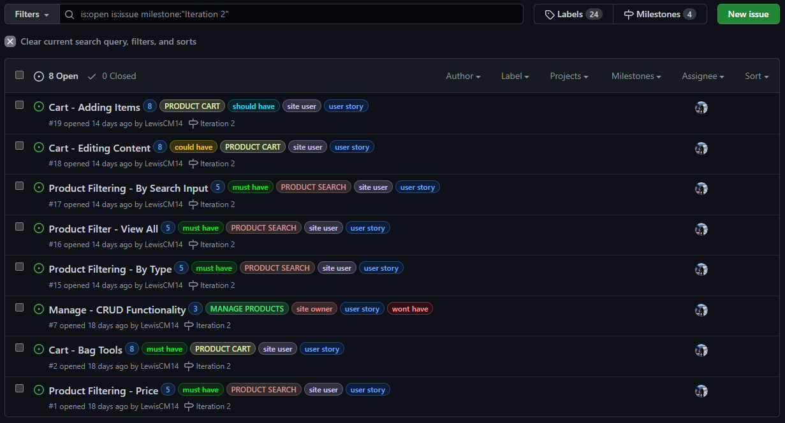

# Classic Confectionery

An e-commerce sweet shop.
___
## Table of Contents 

* [User Experience (UX)](#userexperience)
    * [Site Goal](#sitegoal)
    * [Target Audience](#targetaudience)
    * [Owner Goals](#ownergoals)
    * [How These Goals are Addressed](#goaladdress)
    * [Data Required](#datarequired)
    * [Security Features](#securityfeatures)
* [Design](#design)
    * [Color Scheme](#colorscheme)
    * [Typography](#typography)
    * [Imagery](#imagery)
    * [Layout](#layout)
* [Web Marketing](#marketing)
* [SEO](#seo)
* [Development](#development)
* [Database Schema](#database)
* [Existing Features](#existingfeatures)
* [Features Left to Implement](#toimplement)
* [Testing](#testing)
    * [Bugs Found in Development](#developmentbugs)
    * [Validator Testing](#validators)
    * [Lighthouse](#lighthouse)
    * [Automated Testing](#automated)
    * [Running the Automated Tests](#runningauto)
    * [Manual](#manual)
* [Unfixed Bugs](#bugs)
* [Deployment](#deployment)
* [Create a Clone](#clone)
* [Technologies Used](#tech)
    * [Languages Used](#lang)
    * [Frameworks & Toolkits](#frametool)
    * [Database Management Systems](#dbsm)
    * [Cloud Services](#cloud)
    * [Marketing Services](#marketservice)
    * [Email Backend](#email)
    * [Server](#server)
    * [Version Control](#version)
    * [Libraries, Packages & Applications](#lib)
    * [Programs](#program)
* [Credits](#credits)
    * [Content](#concred)
    * [Media](#media)
___
### User Experience (UX) 

*For this project i initially developed a selection of user personas which my user stories have all been developed from, creating my epics. Below these user personas can be seen.*

* **Peyton Post**

    * Who are they?
        * | *Gender*: Female | *Age*: 21 | *Nationality*: British | *Location*: Stevenage | *Occupation*: Student |
        ---
    * What is their main goal?
        * To order sweets as a birthday present for their 30-year-old brother that he would have eaten as a pre-teen/young child.
        ---
    * What is their barrier to achieving this goal?
        * Unsure of what sweets where popular in the 90’s/’00s.
        ---

* **Rorie Wyatt**

    * Who are they?
        * | *Gender*: Female | *Age*: 38 | *Nationality*: British | *Location*: Edinburgh | *Occupation*: Nurse |
        ---
    * What is their main goal?
        * To buy some sweets their two young children can try (12 & 10), that they ate as a kid.
        ---
    * What is their barrier to achieving this goal?
        * The ability to order a varied selection of sweets in a reasonable quantity. 
        ---

* **Blair Horn**

    * Who are they?
        * | *Gender*: Male | *Age*: 26 | *Nationality*: British | *Location*: Berkshire | *Occupation*: Accountant |
        ---
    * What is their main goal?
        * To buy a large selection of their favorite sweets to take into work and share with their colleagues.
        ---
    * What is their barrier to achieving this goal?
        * The ability to order a large and varied selection of sweets that come in a container suitable for being taken on a work commute. 
        ---

* **Rhys Powell**

    * Who are they?
        * | *Gender*: Male | *Age*: 40 | *Nationality*: British | *Location*: Swansea | *Occupation*: Brick Layer |
        ---
    * What is their main goal?
        * To regularly buy a selection of sweets to keep in the treat draw at home.
        ---
    * What is their barrier to achieving this goal?
        * The ability to browse an online sweet store and create themselves a pick’n’mix style bundle for themselves. 
        ---

* **Augustine Evanson**

    * Who are they?
        * | *Gender*: Male | *Age*: 33 | *Nationality*: British | *Location*: Warrington | *Occupation*: Sweet Seller |
        ---
    * What is their main goal?
        * To start an e-commerce business selling sweets online.
        ---
    * What is their barrier to achieving this goal?
        * They currently don’t have a website.
___

**Site Goal** 

**Target Audience** 

**Owner Goals** 

**How These Goals are Addressed** 

**Data Required** 

**Security Features** 

[Return to Table of Contents](#contents)
___
### Design 

- **Color Scheme** 

    * When developing the color scheme for this project i began by scrolling through images of sweets that span the time period of 1980-2010, as this period captured when millennials would have been children/teenagers, from here i got a vague idea of what colors would be reflective of a typical millennial childhood. I then reinforced my ideas with this [blog post](https://juiceboxinteractive.com/blog/color/). Finally deciding on a scheme that incorporated blue, yellow and pink. From here i began testing different variations of these colors together in the [web aim contrast checker](https://webaim.org/resources/contrastchecker/) to ensure my scheme met [WCAG](https://www.w3.org/WAI/standards-guidelines/wcag/) AAA accessibility guidelines. Not wanting to create a garish display, My final scheme consists of predominantly a charcoal color, set against white (FFFFFF) or cream (The bootstrap color of F8F9FA), with yellow and blue used against it. The color pallet can be seen below.

        

- **Typography** 

    * For this project i wanted a font that echoed the fonts used across popular sweets in the UK from the 90's & '00s. Using this [article](https://metro.co.uk/2015/03/06/23-sweets-that-got-all-our-mouths-watering-in-the-90s-5091799/) and this [blog post](https://www.typewolf.com/google-fonts) I decided that the [Chivo](https://fonts.google.com/specimen/Chivo?query=chiv) font was a good fit. The main body content is styled in the light 300 weight and the headers styled with the italic 900 weight. This mixture brings both the big bold text with crisp edges as well as the light and rounded text, popular on sweet packaging familiar to millennials, to the project. 

- **Imagery** 

- **Layout** 

[Return to Table of Contents](#contents)
___

### Web Marketing 

* Strategy

* Newsletter

* Facebook Business 

[Return to Table of Contents](#contents)
___

### SEO 

* Keywords

[Return to Table of Contents](#contents)
___
### Development 

*The project was developed using an agile methodology, with epics broken down into user stories with well defined acceptance criteria, tasks and wireframes. These issues where then worked on in incremental steps. The sprint times for my iterations was two weeks. The story points applied to my issues follow the fibonacci scale, with the 'Must Have' issues for each iteration kept at 60% of the total time box.*

- **Product Backlog**
    * The product backlog for the project can be found [here](https://github.com/LewisCM14/sweet-shop/milestone/1)

- **Iteration 1**
    
    * The iteration 1 milestone can be found [here](https://github.com/LewisCM14/sweet-shop/milestone/2?closed=1)
    * Iteration 1 board can be found [here](https://github.com/LewisCM14/sweet-shop/projects/1)

- **Iteration 2**
    
    * The iteration 2 milestone can be found [here](https://github.com/LewisCM14/sweet-shop/milestone/3?closed=1)
    * Iteration 2 board can be found [here](https://github.com/LewisCM14/sweet-shop/projects/2)

- **Iteration 3**
    * The iteration 3 milestone can be found [here](https://github.com/LewisCM14/sweet-shop/milestone/4?closed=1)
    * Iteration 3 board can be found here [here](https://github.com/LewisCM14/sweet-shop/projects/3)

- **Iteration 4**
    * The Iteration 4 milestone can be found [here](https://github.com/LewisCM14/sweet-shop/milestone/5?closed=1)
    * Iteration 4 board can be found here [here](https://github.com/LewisCM14/sweet-shop/projects/4)

[Return to Table of Contents](#contents)
___

### Database Schema 

[Return to Table of Contents](#contents)
___
### Existing Features 

[Return to Table of Contents](#contents)
___
### Future Features 

*The product backlog can be viewed [here](https://github.com/LewisCM14/sweet-shop/milestone/1).*

[Return to Table of Contents](#contents)
___
### Testing  

- **Bugs found in Development** 

    ---

- **Validator Testing** 

    - HTML
        - No errors were found when passing through the [W3C Validator tool](https://validator.w3.org/nu/)

    - CSS
        - No errors were found when passing through the [W3C Validator tool](https://jigsaw.w3.org/css-validator/)

    - JAVASCRIPT
        - No custom Javascript is used in the project, so validator testing was not required.

    - Python
        - No errors were found when passing through the [PEP8 Validator tool](http://pep8online.com/).
    ---

- **Lighthouse** 

    ---

- **Automated Tests** 

    * Using the coverage package, i have generated reports for the app

    ---

- **Running the Automated Tests** 

    * Within the terminal on the IDE run the below command, this runs the automated tests.
        
            coverage run --source=**app name** manage.py test
    
    * Once the tests are complete, run the below command to generate the report.
        
            coverage report
    
    * To then view the report in detail run the below command, which will either create or update the *htmlcov* directory.
        
            coverage html
    
    * To view this report in detail use the below command to launch a basic html server and navigate to the *htmlcov* directory in the browser.
        
            python3 -m http.server
    
    * If you do not wish to view the coverage report but simply want to verify all the test's pass, preform the below command and the results will be printed back to you in the terminal.

            python3 manage.py test
    
    ---

- **Manual Testing** 

    * Using devtools on google chrome the application has been tested on various devices to ensure it is fully responsive. 
    
    * Outside of devtools i have ran the site on several browsers including: Brave, Chrome, Firefox and Edge. It appears to function as intended on these browsers. I have also ran it on my own personal pc, laptop and iphone, preforming as intended on each.

[Return to Table of Contents](#contents)
___
### Unfixed Bugs 

[Return to Table of Contents](#contents)
___
### Deployment 

- The site is deployed via [Heroku](https://heroku.com/). The steps to deploy are as follows:

    *It is assumed the GitHub repository for the project is setup correctly as this point.*
     
    *Ensure all requirements for the project are added to the requirements.txt file prior to deployment. The command **pip3 freeze --local > requirements.txt** can be ran in the terminal to do this.*

    *It is also assumed that the Django project is setup as intended, necessary dependencies installed with all apps required added to the INSTALLED_APPS variable and the TEMPLATES variable within settings.py defined correctly, as well as the static and media files.*

    * STAGE ONE - Create a New App in Heroku

        1: From the dashboard on Heroku, select New and then Create new app.
        
        2: Enter an individual app name into the text box, select a relevant region from the dropdown and then press Create app.
        
        *A Heroku app has now been created.*
    
    ---
    
    * STAGE TWO - Add the Database

        1: Navigate to the resources tab for the app that has just been created.

        2: In the Add-Ons section, search for the Heroku Postgres add on and submit an order form.
        
        *The Heroku app is now using a Postgres database, from within the settings tab on the Heroku app the config vars now has a DATABASE_URL variable set.*

        3: At this point, using the psycopg2-binary and dj_database_url packages preform a migration to the Postgres database from within the IDE. Within the settings.py file, comment out the existing database definition and replace it with the code below, ensuring once the migrations have been completed the settings file is reverted back before any commits are made.

            DATABASES = {
                'default': dj_database_url.parse('The DATABASE_URL String from within the config vars on the Heroku app')

    ---
    
    * STAGE THREE - Create a SECRET_KEY

        1: Within the root directory create a env.py file, ensuring env.py is added in the .gitignore file.

        2: Within the env.py file, import os at the top and create a SECRET_KEY environment variable. The string for this variable is decided by the developer.
            
            os.environ["SECRET_KEY"] = "some string"

        3: On the settings tab of the Heroku app, reveal config vars and add the SECRET_KEY variable along with the corresponding string that has just been created.

    ---
    
    * STAGE FOUR - Update the settings.py file

        1: Import dj_database_url and env.py into the settings.py file for the project.
            
            import os
            import dj_database_url

            if os.path.isfile('env.py'):
                import env

        2: Update the default SECRET_KEY variable provided by Django to the SECRET_KEY environment variable.

            SECRET_KEY = os.environ.get('SECRET_KEY')

        3: Define the database. The dj_database_url package is utilized here.

            if 'DATABASE_URL' in os.environ:
                DATABASES = {
                    'default': dj_database_url.parse(os.environ.get('DATABASE_URL'))
                }
            else:
                DATABASES = {
                    'default': {
                        'ENGINE': 'django.db.backends.sqlite3',
                        'NAME': BASE_DIR / 'db.sqlite3',
                    }
                }
        
        *when the app is running on Heroku, where DATABASE_URL is defined in the config vars the application connects to Postgres, otherwise it connects locally to sqlite light.*

        4: Update the allowed hosts.
            
            ALLOWED_HOSTS = ['sweet-shop-lewiscm.herokuapp.com', 'localhost', ]
        
        *Allows the Heroku app to host the project as well as it be hosted locally within the IDE*

    ---

    * STAGE FIVE - Turn DEBUG off in Deployment

        1: Within the settings tab on gitpod workspaces, navigate to the variable tab and create the 'DEVELOPMENT = True' variable for the projects workspace.

        2: Alter the DEBUG variable within the settings.py file.

            DEBUG = 'DEVELOPMENT' in os.environ
        
        *If DEVELOPMENT variable set within environment DEBUG = True else DEBUG = False on Heroku as no DEVELOPMENT variable*

    ---

    * STAGE SIX - Define Email Backend Settings

        *This stage assumes that a gmail smtp already setup for use in the application with an app specific password.*

        1: Within the settings.py file for the project, at the email backend definition, update the code to the below settings.

            if 'DEVELOPMENT' in os.environ:
                EMAIL_BACKEND = 'django.core.mail.backends.console.EmailBackend'
                DEFAULT_FROM_EMAIL = 'classicconfectionery.notice@example.com'
            else:
                EMAIL_BACKEND = 'django.core.mail.backends.smtp.EmailBackend'
                EMAIL_USE_TLS = True
                EMAIL_PORT = 587
                EMAIL_HOST = 'smtp.gmail.com'
                EMAIL_HOST_USER = os.environ.get('EMAIL_HOST_USER')
                EMAIL_HOST_PASSWORD = os.environ.get('EMAIL_HOST_PASS')
                DEFAULT_FROM_EMAIL = os.environ.get('EMAIL_HOST_USER')
        
        *This code checks if DEVELOPMENT is in the environment If that variable is set,  emails are logged to the console. If DEVELOPMENT not in environment, email backend is an smtp and required settings are defined.*

        2: Then from within the settings tab on the Heroku app, add the below variables with the corresponding string to the config vars.

            EMAIL_HOST_PASS = 'App specific password provided by google'
            EMAIL_HOST_USER = 'classicconfectionery.notice@gmail.com'
        
        *The deployed project now uses gmail for email backend and locally emails are shown in the console.*
    
    ---

    * STAGE SEVEN - Connect app to AWS

        *It is assumed an S3 bucket is already setup correctly at this point*

        1: Within the projects settings.py file, at the static file's definition for the project add the below code.

            STATIC_URL = '/static/'
            STATICFILES_DIRS = (os.path.join(BASE_DIR, 'static'),)

            MEDIA_URL = '/media/'
            MEDIA_ROOT = os.path.join(BASE_DIR, 'media')

            if 'USE_AWS' in os.environ:

                # Cache control
                AWS_S3_OBJECT_PARAMETERS = {
                    'Expires': 'Thu, 31 Dec 2099 20:00:00 GMT',
                    'CacheControl': 'max-age=94608000',
                }

                # Bucket Config
                AWS_STORAGE_BUCKET_NAME = 'sweet-shop-lewiscm'
                AWS_S3_REGION_NAME = 'eu-west-2'
                AWS_ACCESS_KEY_ID = os.environ.get('AWS_ACCESS_KEY_ID')
                AWS_SECRET_ACCESS_KEY = os.environ.get('AWS_SECRET_ACCESS_KEY')
                AWS_S3_CUSTOM_DOMAIN = f'{AWS_STORAGE_BUCKET_NAME}.s3.amazonaws.com'

                # Static and media files
                # see custom_storages.py
                STATICFILES_STORAGE = 'custom_storages.StaticStorage'
                STATICFILES_LOCATION = 'static'
                DEFAULT_FILE_STORAGE = 'custom_storages.MediaStorage'
                MEDIAFILES_LOCATION = 'media'

                # Override static and media URLs in production
                STATIC_URL = f'https://{AWS_S3_CUSTOM_DOMAIN}/{STATICFILES_LOCATION}/'
                MEDIA_URL = f'https://{AWS_S3_CUSTOM_DOMAIN}/{MEDIAFILES_LOCATION}/'

        2: Within the settings tab on the Heroku app, update the config vars to include the AWS_ACCESS_KEY_ID & AWS_SECRET_ACCESS_KEY variables with the corresponding string from the AWS management page

        3: Add the USE_AWS variable to the config vars, set to True.

            USE_AWS = True

        *The deployed project now uses Amazon Web Services S3 to host static files and the IDE hosts them locally.*
    
    ---

    * STAGE EIGHT - Link Deployed Project to Stripe

        1: Add the below variables to the Heroku apps config vars with the corresponding string from the Stripe dashboard.

            STRIPE_PUBLIC_KEY
            STRIPE_SECRET_KEY
            STRIPE_WH_SECRET
        
        2: FINISH LATER
    
    ---
    
    * STAGE NINE - Create a Procfile

        1: Ensure gunicorn is installed.

        2: Create a Procfile at the top level of the directory.

        2: Within this file, declare the below command. This command ensures gunicorn is used as the web server.

            web: gunicorn sweet_shop.wsgi:application
        
        *Add, commit and push to the repository at this point*
    
    ---
    
    * STAGE TEN - Connect the GitHub repository to the Heroku App

        1: Within the Deploy tab on the Heroku app, choose GitHub as the deployment method.

        2: Search for the correct repository and connect.

        3: At the bottom of the deployment section there is an option to chose which branch to deploy. Chose the main branch and allow the build log to complete.

        4: Once complete, chose to allow automatic deployment from here onwards.

        *The app has now been deployed successfully. The live link can be found [here](https://sweet-shop-lewiscm.herokuapp.com/)*

        **Be aware, from this point onwards, all changes made to the database in development will have to be migrated to the deployed database separately in order to take effect. This can be done by changing the DATABASES dictionary in the settings.py file to point directly at the heroku database, as done in stage 2, DO NOT commit to GitHub with this setting saved.**

    ---
[Return to Table of Contents](#contents)
___

## Create a Local Clone 

- Follow the steps below in order to create a local clone using HTTPS.

    * STEP ONE - Navigate to the GitHub repository for the project. Located [here](https://github.com/LewisCM14/sweet-shop).
    
    * STEP TWO - From the tabs displayed, click the **Code** tab. This presents a drop down menu.

    * STEP THREE - Ensure this menu is on the **HTTPS** tab and copy the URL.

    * STEP FOUR - On your chosen IDE open Git Bash, Change the current working directory to the location where you want the cloned directory.
    
    * STEP FIVE - Type git clone, and then paste the URL you copied earlier.

            $ git clone https://github.com/LewisCM14/sweet-shop.git
    
    * STEP SIX - Press Enter to create your local clone.

    *If GitPod is your chosen IDE from the link above the Gitpod button can be clicked to open up the repository code on your local machine* 

[Return to Table of Contents](#contents)
___
## Technologies Used 

- **Languages Used** 

    * HTML
    * CSS
    * JAVASCRIPT
    * PYTHON
    * MARKDOWN

- **Frameworks & Toolkits** 

    * **[Django 3.2](https://www.djangoproject.com/download/).**
        * Python based web framework, used to build the application.
    
    * **[Bootstrap](https://getbootstrap.com/).**
        * A front-end open source toolkit, used across the application.
    
    * **[Font Awesome](https://fontawesome.com/).**
        * The [font awesome free](https://pypi.org/project/fontawesomefree/) kit is used for icons across the site.

- **DBMS** 
    
    * **[PostgreSQL](https://www.postgresql.org/).**
        * The relational database management system used.

- **Cloud Services** 

    * **[Heroku](https://id.heroku.com/login).**
        * The platform my project is deployed on.

    * **[AWS S3](https://aws.amazon.com/s3/).**
        * A cloud-based storage service. Used to store my static files in deployment.

- **Marketing Services** 

    * **[Mailchimp](https://mailchimp.com/).**
        * Used to gather and store the email address of people who sign up for the newsletter.

- **Email Backend** 

    * **[Gmail](https://mail.google.com).**
        * Mail provider used as the smtp host for email backend.

- **Server** 

    * **[Gunicorn](https://gunicorn.org/).**
        * The server used to run Django on Heroku.

- **Version Control** 
    
    * **Git.**
        * Git was used for version control by utilizing the GitPod terminal to commit to Git and Push to GitHub.

    * **[GitHub](https://github.com/).**
        * GitHub is used to store the projects code after being pushed from Git.
    
    * **[Gitpod](https://www.gitpod.io/docs/).**
        * The IDE used to build the project.

- **Libraries, Packages and Applications** 

    * **[dj_database_url](https://pypi.org/project/dj-database-url/).**
        * A PostgreSQL supporting library. Allows you to utilize the 12factor inspired DATABASE_URL environment variable to configure your Django application.
    
    * **[pyscopg2-binary](https://www.psycopg.org/docs/).**
        * PostgreSQL database adapter for the Python programming language.    
    
    * **[allauth](https://django-allauth.readthedocs.io/en/latest/installation.html).**
        * Used for creation and maintenance of user accounts.
    
    * **[django-storage](https://django-storages.readthedocs.io/en/latest/).**
        * Built upon with boto3 to help facilitate the storage of static and media files on AWS S3.

    * **[boto3](https://boto3.amazonaws.com/v1/documentation/api/latest/index.html).**
        * Used to help facilitate the storage of static and media files on AWS S3.
    
    * **[crispy-forms](https://django-crispy-forms.readthedocs.io/en/latest/index.html).**
        * Used for rendering forms.

    * **[Django Countries](https://pypi.org/project/django-countries/).**
        * Used on the country field in relevant models.
    
    * **[coverage](https://coverage.readthedocs.io/en/6.3/).**
        * Used to access the coverage of my automated tests for python code.
    
    * **[pillow](https://pypi.org/project/Pillow/).**
        * Used to allow for ImageField type on the applications models.
     
- **Programs** 

    * **Slack.**
        * Specifically the peer-code_review channel on Code Institutes Slack workspace. Used to increase the scope of my testing.
    
    * **Balsamiq.** 
        * Used to create the wire frames during the development process.

    * **[Iconifier](https://iconifier.net/).**
        * Used to convert the favicon image to the correct size and file type.
    
    * **[WebAIM Contrast Checker](https://webaim.org/resources/contrastchecker/).**
        * Used to ensure my color pallet met WCAG AAA accessibility guidelines.
       
[Return to Table of Contents](#contents)
___
## Credits  

* A special thank you to my mentor Rohit Sharma. 

* Thanks to the Code Institute tutor support team, who helped me develop my understanding throughout this project.

* Finally thanks to my peers on Slack who responded to my questions.  

- **Content** 

    * The footer for the site is developed from this [md bootstrap template](https://mdbootstrap.com/snippets/standard/mdbootstrap/2885008?view=side).

    * This [blog post](https://micropyramid.com/blog/django-unit-test-cases-with-forms-and-views/) was used to help develop my understanding of writing tests with Django's TestCase package. Particularly for the test_views.py file in the profiles app.

    * I used this [blog post](https://www.hotjar.com/blog/user-personas/) to help be develop my user personas.

    * I used this [blog post](https://juiceboxinteractive.com/blog/color/) to aide in developing the color scheme for the site.

    * I used Marko Denic's [buttons generator](https://markodenic.com/tools/buttons-generator/) to develop the buttons across the application.

    * I used this [post](https://stackoverflow.com/questions/66231936/change-accordion-button-collapsed-icon-color-in-bootstrap-5) on stackoverflow to alter the toggle button on my FAQ accordion.

    * I used this [post](https://stackoverflow.com/questions/2897609/how-can-i-unit-test-django-messages/14909727) on stackoverflow in order to develop my knowledge on how to test the Django message framework behaved as i intended.

    * I used this [guide](https://developer.mozilla.org/en-US/docs/Web/CSS/filter-function/blur) for learning how to use the blur function in CSS. 

- **Media** 

[Return to Table of Contents](#contents)
___